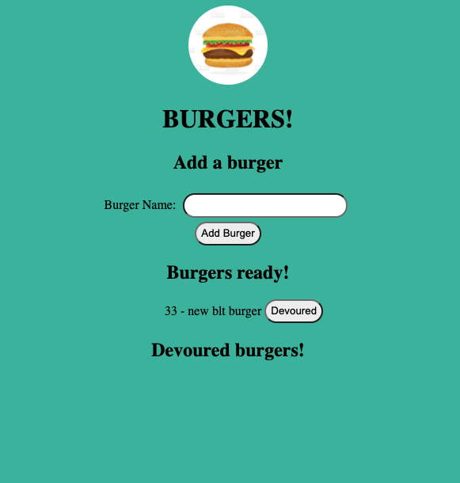

# Burger Logger

## Table of Content

* [Description](#description)
* [Requirements](#requirements)
* [Screenshots](#screenshots)
* [Link to Page](#link-to-page)
* [Tools](#tools)

## Description

Create a burger logger with MySQL, Node, Express, Handlebars and a homemade ORM (yum!). Be sure to follow the MVC design pattern; use Node and MySQL to query and route data in your app, and Handlebars to generate your HTML.

## Requirements 

Burger-logger is a restaurant app that lets users input the names of burgers they'd like to eat.

* Whenever a user submits a burger's name, the app will display the burger under the 'burger ready!' list -- waiting to be devoured.

* Each burger in the waiting area also has a `Devoured!` button. When the user clicks it, the burger will move to the bottom list.

## Screenshots

## Link to Page

<https://nameless-falls-66749.herokuapp.com/>

## Tools

* Visual Studio Code <https://code.visualstudio.com>.
* Create package.json with npm init -y.
* Install express, express-handlebars, and mysql.

